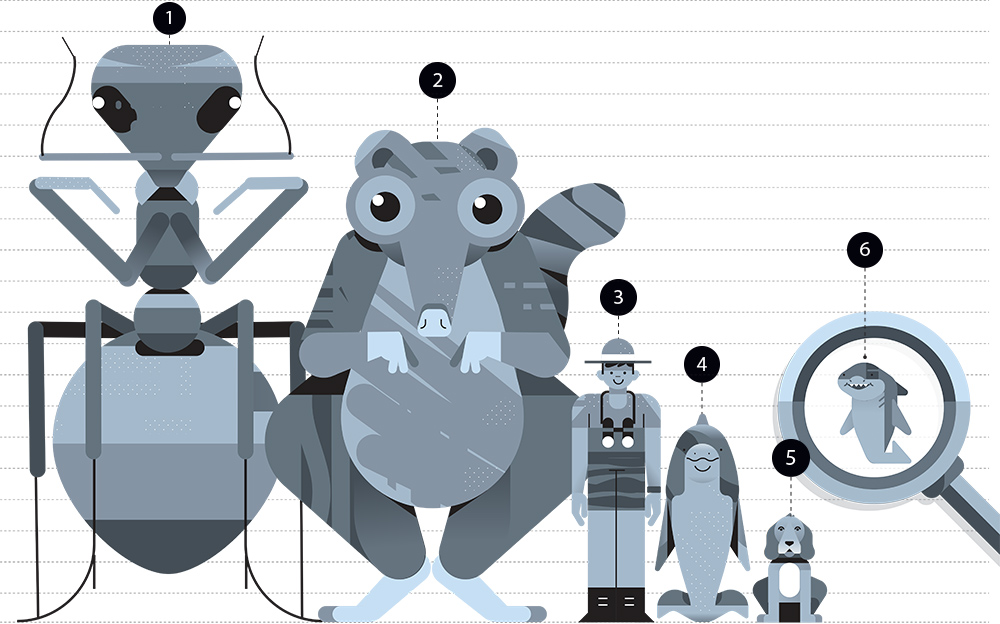

# plotting-linear-regression-residuals
Plotting linear regression residuals for both single linear model and null model.
<figure>
  
  <figcaption>Fig.1 - Regression segments of fitted brain size values of mammals explained by weight compared to the null model</figcaption>
</figure>

<figure>
  
  <figcaption>https://www.popsci.com/what-does-brain-size-have-to-do-with-intelligence/</figcaption>
</figure>
