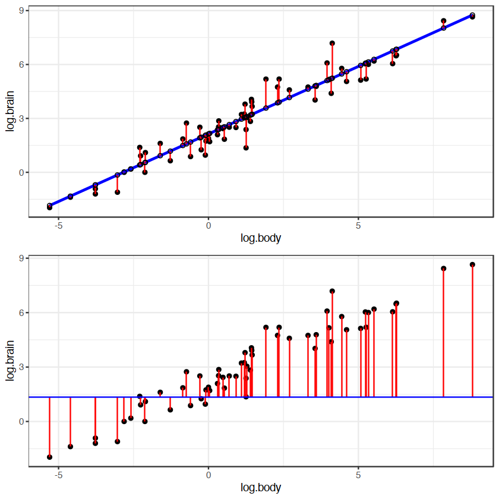

# plotting-linear-regression-residuals
Plotting linear regression residuals for both single linear model and null model.

<figure>
  
  <figcaption>Fig.1 - Brain and body size relation in mammals</figcaption>
</figure>

~~~
ggplot(d,aes(x=log.body,y=log.brain))+geom_point()+
       geom_smooth(method = "lm", se = FALSE, color = "blue")+
  geom_segment(aes(xend =log.body, yend = .fitted),color="red")+
  geom_point(aes(y = .fitted), shape = 1)+theme_bw()`
~~~
~~~
ggplot(d,aes(x=log.body,y=log.brain))+geom_point()+
  geom_segment(aes(xend =log.body, yend = mean(log.body)),color="red")+ 
geom_hline(yintercept=mean(d$log.body),color = "blue")+theme_bw()
~~~

<figure>
  
  <figcaption>Fig.2 - Regression segments of fitted brain size values of mammals explained by weight compared to the null model</figcaption>
</figure>
